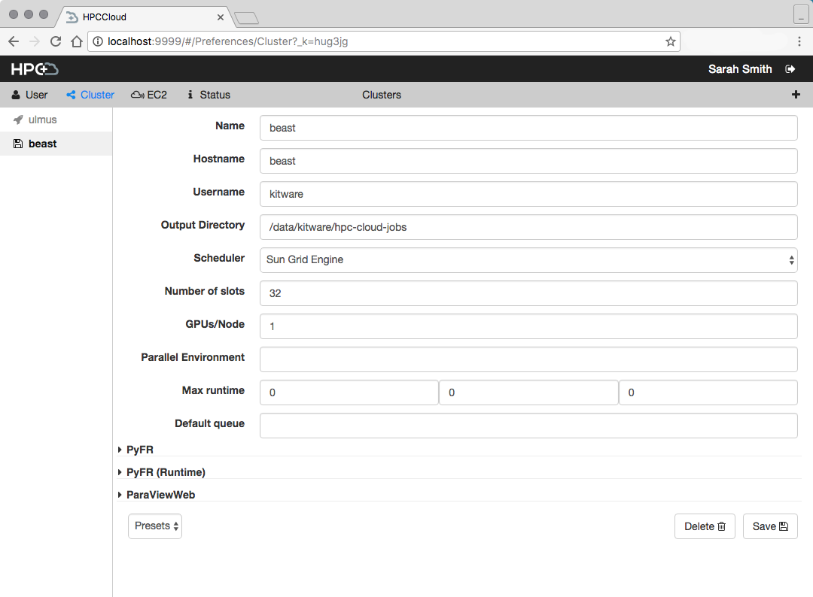

# Traditional Clusters

Traditional clusters, or simply "clusters" in this document typically involve physical hardware dedicated to running simulations within the host operating system. To get to the page for Traditional Clusters go to the preferences page -by clicking on the username in the top right- and click "Cluster."

## Creating

Click the "+" icon in the toolbar. You'll be presented a blank form in which you can fill out details of your cluster. A cluster name, username and hostname of the machine is required. When you have the necessary fields filled out click "Save." A "Test" button and a form field with an shell command containing an ssh key will soon appear.

### Testing

Copy the shell command from the form field and paste it in a terminal. The command tries to connect to your cluster and if successful adds an ssh key to the cluster's key chain. This permits HPC-Cloud's backend (Cumulus) to connect to your cluster and run jobs and simulations. Click the "Test" button when the command is run and the key is saved on your cluster. If the test is successful cluster is ready to use in simulations.

## Editing
You can only edit the name of a cluster. If you need to change another detail delete and recreate the cluster.

## Deleting

You cannot delete clusters which are running simulations. With the cluster you want to delete selected, click "Delete cluster." You will be prompted before the cluster is deleted. You can always re-add a deleted cluster, however the files generated from simulations will not be available through HPC-Cloud.
